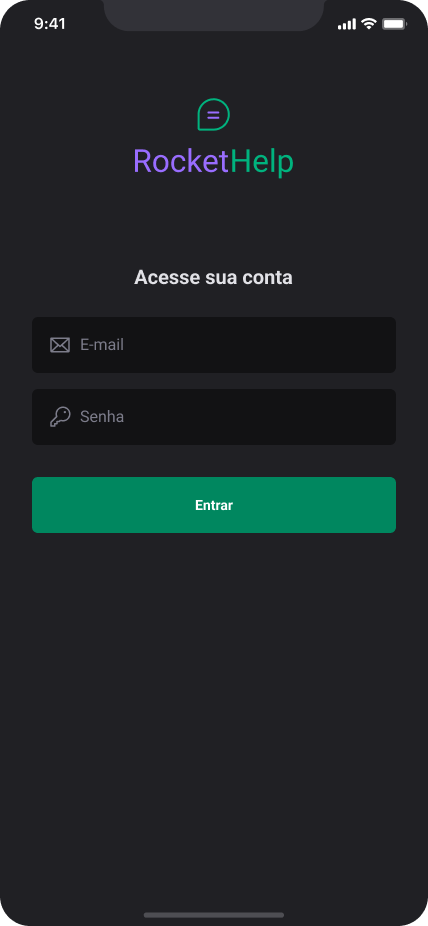
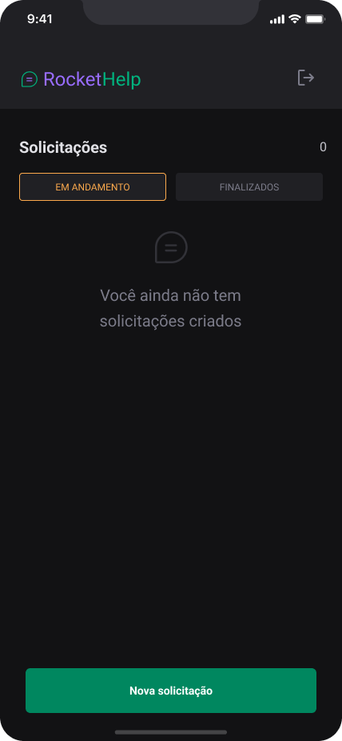
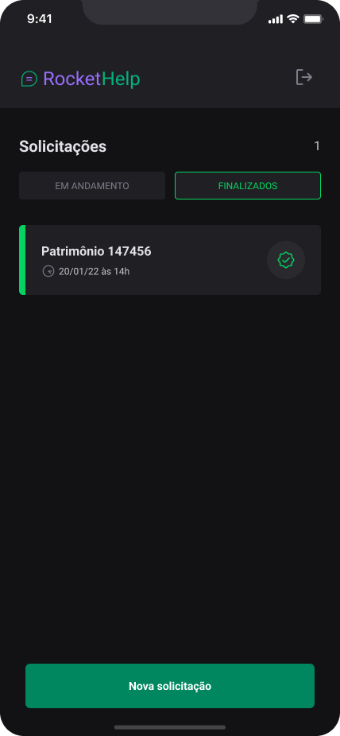
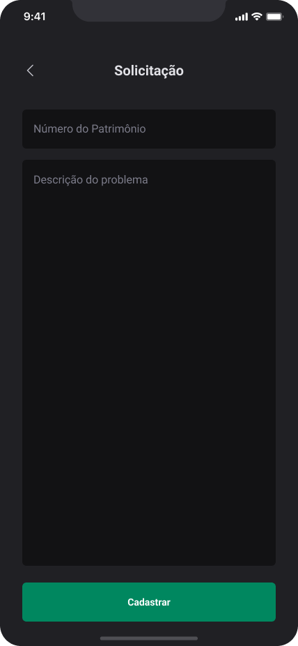
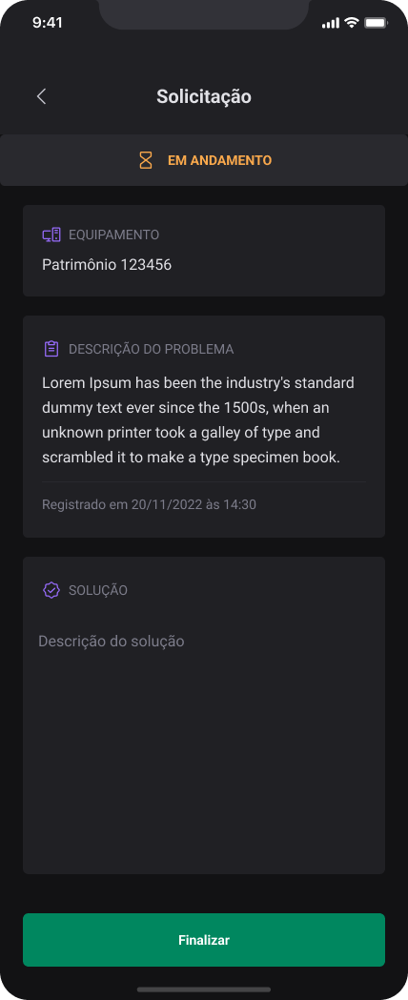
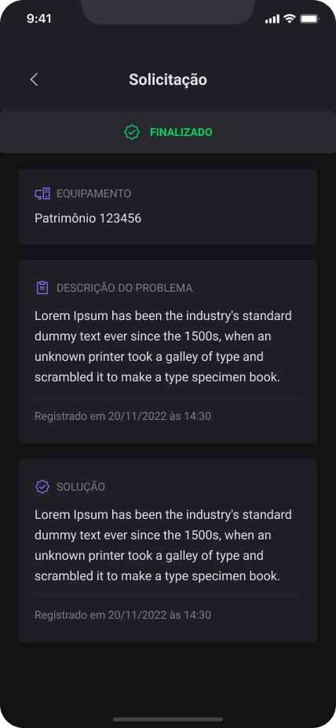

    <h1> Rocket Help </h1>

 

   

 
 

<h3 align = "center">
  IGNITE LAB 3 - REACT NATIVE
</h3>

| | | | |
|:-------------------------:|:-------------------------:|:-------------------------:|:-------------------------:|
| | | || 
||||
 

 <a href="#target">Target</a> •
 <a href="#technologies">Technologies</a> •
 <a href="#route">Route</a> 

 
 

<h2> 💡 Target </h2>
Build an user request support mobile app for Android and iOS (Hybrid) using React Native

 

<h2> 🛠 Technologies </h2>
The main technologies that has been used in this project were:
 
 |                  Type                  |                Tools                |                                 References                                  |
| :------------------------------------: | :---------------------------------: | :-------------------------------------------------------------------------: |
|       Programming Language (App)       |                REACT NATIVE                 |              https://reactnative.dev/                           | 
|       Programming Language (App)       |                TYPESCRIPT                   |              https://www.typescriptlang.org/                    | 
|       Open source platform             |           EXPO BARE WORKFLOW                |              https://expo.dev/                                  | 
|                   IDE                  |        VISUAL STUDIO CODE (VS CODE)         |              https://code.visualstudio.com/                     |
|        Design Interface Tool           |         FIGMA  (Prototype - UX/UI)          |              https://www.figma.com/                             |
|   UI Utility-first Component Library   |                  NATIVE BASE                |              https://nativebase.io/                             |
|              Graphic components        |                 PHOSPHOR ICONS              |              https://phosphoricons.com/                         |
|       Navigation between pages         |              REACT NAVIGATION               |              https://reactnavigation.org/                       |
|    Open source Node.js Headless CMS    |                   STRAPI                    |              https://strapi.io/                                 |
| Promise based HTTP client - browser & Node.js |             AXIOS                    |              https://axios-http.com/                            |
|       Data persistence on device       |                ASYNC STORAGE                |              https://react-native-async-storage.github.io/async-storage/docs/usage/ |
|             Database                   |                    FIREBASE                 |              https://console.firebase.google.com/               |
| React Native support Library for Firebase |             REACT NATIVE FIREBASE           |              https://rnfirebase.io/                             |
|              Deploy Project            |                    VERCEL                   |              https://vercel.com/                                |

 
 

  <!-- <h3>Backend | API</h3> -->
  <h3>Database</h3>
  
   
  <h3>IDE</h3>
  
   
  <h3>UX/UI</h3>
  
  
  
   
  <h3>Frontend</h3>
  
  
  
  
   
  
   
  <h3>Deploy</h3>
  
   

<h2> 🔎 Route </h2>

<ol>
    <li>Part 1 - The beginning of the React Native specialization
      <ul>
        <li>Build the project prototype: https://www.figma.com/file/15HnazfsI1NFV13fIXy1wu/React-Native-Insider-5?node-id=0%3A1</li>
        <li>Install VS Code (IDE)</li>
        <li>Install "R Component" extension at VS Code</li>
        <li>Install Expo CLI: npm install --global expo-cli</li>
        <li>Create a new project: expo init my-app (bare workflow)</li>
        <li>Navigate to project directory: cd my-app</li>
        <li>Open the project on VS Code: code .</li>
        <li>Change App.js to App.tsx</li>
        <li>Create and set tsconfig.json at root</li>
        <li>Install Native Base on project:
          <ul>
            <li>yarn add native-base</li>
            <li>expo install react-native-svg </li>
            <li>expo install react-native-safe-area-context</li>
          </ul>
        </li>
        <li>Install React Navigation on project:
          <ul>
            <li>expo install @react-navigation/native</li>
            <li>expo install react-native-screens</li>
            <li>expo install react-native-safe-area-context</li>
            <li>expo install @react-navigation/native-stack</li>
          </ul>
        </li>
        <li>Start the development server: expo start</li>
        <li>Configure the Expo Go on a mobile device or use an emulator</li>
        <li>Open the app on a mobile device:
          <ul>
            <li>On your iPhone or iPad, open the default Apple "Camera" app and scan the QR code you see in the terminal</li>
            <li>On your Android device, press "Scan QR Code" on the "Projects" tab of the Expo Go app and scan the QR code you see in the terminal.</li>
          </ul>
        </li>
      </ul>
    </li>
     
    <li>Part 2 - Visual design project & Navigation
      <ul>
        <li>Set project assets and styles</li>
        <li>Install fonts on project: expo install expo-font @expo-google-fonts/roboto</li>
        <li>Create screens: 
          <ul>
            <li>Signin.tsx</li>
            <li>Home.tsx</li>
            <li>Register.tsx</li>
            <li>Details.tsx</li>
          </ul>
        </li>
        <li>Create new components: 
          <ul>
            <li>Loading.tsx</li>
            <li>Input.tsx</li>
            <li>Button.tsx</li>
            <li>Filter.tsx</li>
            <li>Order.tsx</li>
            <li>Header.tsx</li>
          </ul>
        </li>
        <li>Procedure to project recognize svg files:
          <ul>
            <li>Install React-Native-SVG-Transformer library: yarn add --dev react-native-svg-transformer</li>
            <li>Set metro.config.js</li>
            <li>Set svg.d.ts file: ./src/@types/svg.d.ts</li>
          </ul>
        </li>
        <li>Install Phosphor React Native Icons: yarn add phosphor-react-native</li>
        <li>Adding Phosphor Icons to SignIn screen</li>
        <li>Add components at Home screen: ./src/screens/Home.tsx</li>
        <li>Add Header, Input and Button components at Register screen: ./src/screens/Register.tsx</li>
        <li>Add Header component at Details screen: ./src/screens/Details.tsx</li>
        <li>Create routes:
          <ul>
            <li>AppRoutes: ./src/routes/app.routes.tsx</li>
            <li>Routes: ./src/routes/index.tsx</li>
          </ul>
        </li>
        <li>Set navigation types: ./src/@types/navigation.d.ts</li>
        <li>Implement navigation function at Home screen: ./src/screens/Home.tsx</li>
        <li>Implement return button at Header component: ./src/components/Header.tsx</li>
        <li>Apply useRoute hook at Details screen: ./src/screens/Details.tsx</li>
      </ul>
     
    <li>Part 3 - Integration with Firebase</li>
      <ul>  
        <li>We still can't run Firebase in Expo development environment. Set the environment: 
            https://react-native.rocketseat.dev/</li>
        <li>Create a Firebase account, if you don't have one</li>
        <li>Create a project on Firebase</li>
        <li>Set the Firebase Authentication, enabling only "E-mail/password"</li>
        <li>Add an user: eg. email = alex@email.com | password = 123456</li>
        <li>Set the Firebase FirestoreDatabase, enabling on "Start at test mode"</li>
        <li>Connecting Firebase with our application
          <ul> 
            <li>Set React Native Firebase library (http://rnfirebase.io)
              <ul>
                <li>Install & setup the app module: yarn add @react-native-firebase/app</li>
                <li>Install settings with Expo at app.json (plugin)</li>
                <li>Add Firebase config (Google services) files for iOS and Android at project root</li>
                <li>Prebuild project: expo prebuild</li>
                <li>Install the firestore module: yarn add @react-native-firebase/firestore</li>
                <li>Install the authentication module: yarn add @react-native-firebase/auth</li>
              </ul>
            </li>
          </ul>
        </li>
        <li></li>
        <li>Set the Firebase Storage</li>
        <li>Download and put google-services.json file into the folder indicated by Firebase</li>
        <li>Compile the project and run it via emulator or physically via smartphone ou tablet with Android system higher than 4.1 (Jelly Bean)</li>
        <li>Obs: Tested with MIUI Global 12.0.3</li>
</ul>
        <li>Build the Home page: ./src/pages/Home/index.js</li>
        <li>Setting routes: ./src/routes.js</li>
        <li>Update ./App.js</li>
        <li>Repeat the previous procedures for Detail, CategoryPosts and Search pages</li>
        <li>Set header for the pages: ./src/routes.js</li>
        <li>Use SafeAreaView to avoid broken screens: ./src/pages/Home/index.js</li>
        <li>Install Axios (HTTP request) module: expo install axios</li>
        <li>Install Async Storage module: expo install @react-native-async-storage/async-storage</li>
        <li>Stop and restart server</li>
        <li>React Hooks usage</li>
        <li>Creating server: ./src/services/api.js  
            * Obs.: React Native requires a safe connection (e.g. https://)  
            When it is not possible, we need to find our device ipconfig (IPv4)  
            Then, substitute "localhost" with this numbers (e.g. http://192.168....)
        </li>
        <li>Install react-native-dotenv module: expo install react-native-dotenv</li>
        <li>Enter .env on .gitignore</li>
        <li>Create a .env file for sensible data: ./.env</li>
        <li>Go to the Home page: ./src/pages/Home/index.js</li>
        <li>Recover the api info and build the posts list</li>
        <li>Subdividing some parts in Components: ./src/components</li>
        <li>Creating features/functionalities</li>
        <li>Create a favorite service: ./src/services/favorite.js</li>
        <li>Create a favorite component: ./src/components/FavoritePost/index.js</li>
        <li>Favoriting categories, save on AsyncStorage and show them on screen: ./src/pages/Home/index.js</li>
      </ul>
    </li>
     
    <li>Part 4 - Bringing the project to life
      <ul>
        <li>Request posts on Home page: ./src/pages/Home/index.js</li>
        <li>Build PostItem component: ./src/components/RenderItem/index.js</li>
        <li>Link Posts from Home to Details page</li>
        <li>Create Detail interface: ./src/pages/Detail/index.js</li>
        <li>Using ScrollView for long items</li>
        <li>Install React-Native-Webview: expo install react-native-webview</li>
        <li>Create a LinkWeb modal component (link from post): ./src/components/LinkWeb/index.js</li>
      </ul> 
    </li> 
     
    <li>Part 5 - Adding features Deploy, CodeGen and next steps
      <ul>
        <li>Build Search input: ./src/pages/Search/index.js</li>
        <li>Find a desirable post from title</li>
        <li>Show posts found on screen</li>
        <li>Only stop showing device keyboard if found a post</li>
        <li>Update Home page with refresh option</li>
        <li>Build CategoryPosts page: ./src/pages/CategoryPosts/index.js</li>
        <li>Adding some animations (React Native Animatable): expo install react-native-animatable</li>
        <li>Use animation on Home page</li>
      </ul> 
    </li>
</ol>

 
 